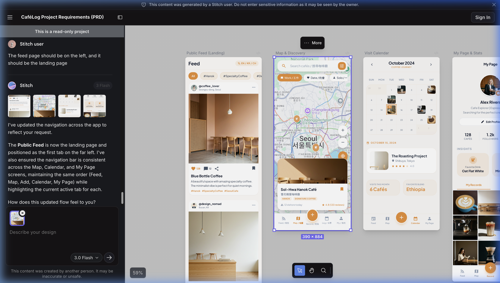
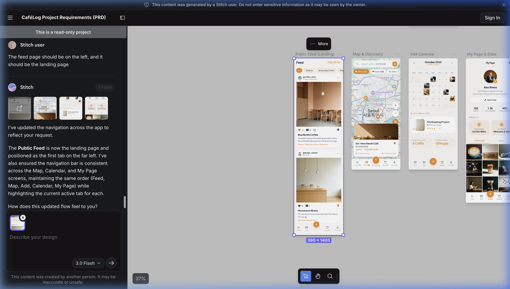
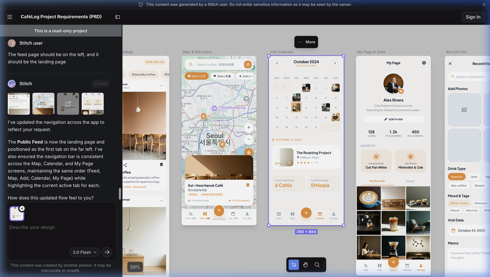
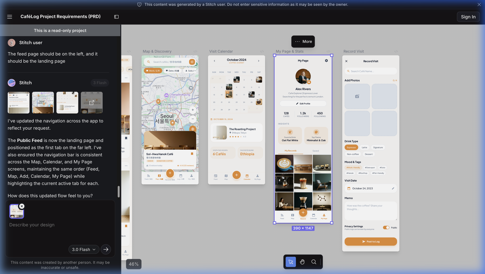
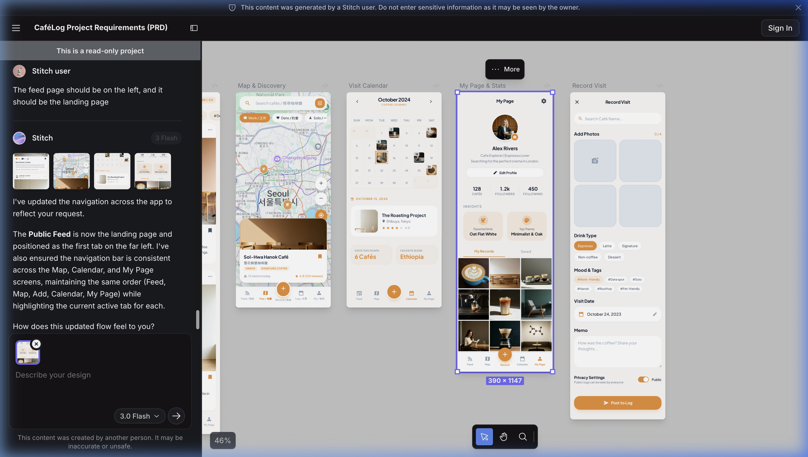

# CaféLog Wireframes

This document provides an overview of the wireframes captured from the Stitch project.

## Screens Overview

### 1. Map & Discovery

- **ID:** `029859305dec4b01941205303e9bf5e1`
- **Description:** Main interface for discovering cafes on a map.

### 2. Public Feed (Landing)

- **ID:** `871a5cb6e2464dadaf5c9dec14ed3736`
- **Description:** Landing page showing community activity and feed.

### 3. Visit Calendar

- **ID:** `68ea5484dc654d45af3abcca5267ccd1`
- **Description:** Calendar view for tracking previous cafe visits.

### 4. My Page & Stats

- **ID:** `515fa08248c24ae4b9fc8724273bab69`
- **Description:** User profile and statistics for cafe logs.

### 5. Record Visit

- **ID:** `cd25be4af9a64e8fa6d638c978415f0e`
- **Description:** Interface for recording a new cafe visit.
